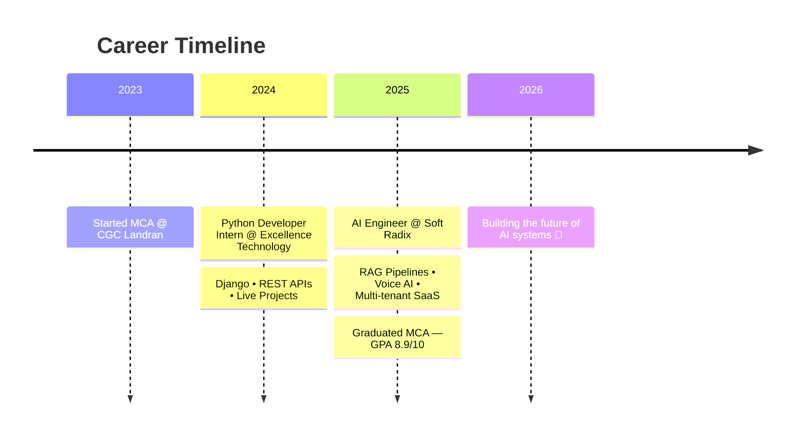

<!-- Animated Wave Header -->


<!-- Animated Typing Intro -->
<p align="center">
  <a href="https://git.io/typing-svg">
    
  </a>
</p>

<!-- Social Badges -->
<p align="center">
  <a href="https://linkedin.com/in/YOUR-LINKEDIN"></a>
  <a href="mailto:rushilverma7@gmail.com"></a>
  
</p>

<br>

<!-- About Me with animated gif -->


## 🧑‍🚀 About Me

```python
class RushilVerma:
    def __init__(self):
        self.role = "AI Engineer @ Soft Radix"
        self.location = "Mohali, Punjab 🇮🇳"
        self.education = "MCA • GPA 8.9/10"
        self.building = ["RAG Pipelines", "LLM Chatbots",
                         "Voice AI", "Automation Engines"]
        self.daily_fuel = ["Python", "FastAPI", "OpenAI", "☕"]

    def current_mission(self):
        return "Shipping AI systems that scale 🚀"
```

- 🔭 Architecting **multi-tenant AI SaaS platforms** & real-time analytics chatbots
- 🧠 Deep in **LangChain · FAISS · PGVector · Prompt Engineering**
- 🎙️ Building **multilingual voice assistants** with Vapi + RAG
- 👨‍🏫 Mentoring interns on backend craft & code reviews

<br clear="right"/>


## ⚡ Tech Arsenal

<div align="center">

### 💻 Languages & Frameworks


### 🤖 AI / GenAI


### 🛠️ Backend, DevOps & Cloud


### 🔄 Automation & Scraping


</div>


## 🌟 Featured Projects

<table>
<tr>
<td width="50%">

### 🤖 Real-Time Analytics Chatbot
`FastAPI` `OpenAI` `WebSockets` `RAG`

Secure, **role-based** (Admin/Agent/Client) chatbot with RAG-powered, context-aware responses over optimized REST + WebSocket APIs.

</td>
<td width="50%">

### 🛡️ Unscammy — Scam Protection
`FastAPI` `Playwright` `Celery` `Docker` `n8n`

Full backend for a **multi-module scam protection platform**: LLM chatbots, voice reporting, phishing simulation & data-broker removal automation.

</td>
</tr>
<tr>
<td width="50%">

### 📊 Auditor Alpha — Revenue Audit AI
`n8n` `PostgreSQL` `PGVector` `OpenAI`

Architected the system + AI audit engine using **multi-method matching** (ID, semantic embeddings, heuristics) to detect revenue leakage across CRM & accounting platforms.

</td>
<td width="50%">

### 🌐 Multilingual Voice & Chat Assistant
`OpenAI` `Vapi` `RAG` `FastAPI`

**Multilingual AI voice + chat support** integrated into a live product — RAG knowledge base of product policies resolving issues in real time.

</td>
</tr>
<tr>
<td width="50%">

### 📈 Insurance CRM Automation
`GoHighLevel`

CRM workflows, lead pipelines & **intelligent multi-region lead assignment** logic for an insurance product.

</td>
<td width="50%">

### 🔗 Leads That Work — LinkedIn Automation
`Python` `Playwright` `Selenium`

Automated **LinkedIn lead generation & engagement** with secure multi-profile management and personalized outreach.

</td>
</tr>
</table>


## 💼 Journey So Far




## 📊 GitHub Analytics

<p align="center">
  
  
</p>

<p align="center">
  
</p>

<p align="center">
  
</p>

<!-- Trophies -->
<p align="center">
  
</p>

<!-- Contribution Snake Animation -->
<p align="center">
  
</p>


<!-- Quote -->
<p align="center">
  
</p>

<h3 align="center">💜 "Turning ideas into intelligent solutions."</h3>

<!-- Animated Wave Footer -->

