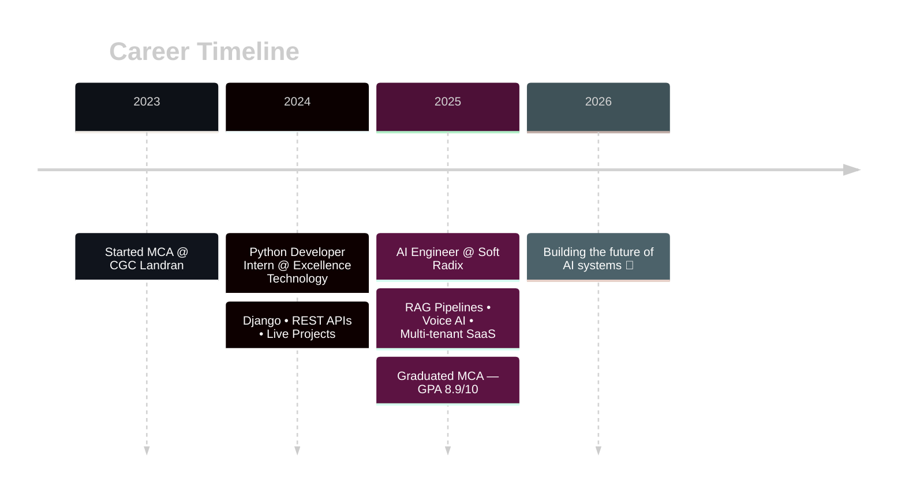

<!-- ⚡ DARK NEON HEADER -->


<!-- Matrix-style typing animation -->
<p align="center">
  
</p>

<!-- Neon badges -->
<p align="center">
  <a href="https://www.linkedin.com/in/rushilverma/"></a>
  <a href="mailto:rushilverma7@gmail.com"></a>
  
</p>

<br>

<!-- About with terminal aesthetic -->


##  whoami

```bash
┌──(rushil㉿ai-engineer)-[~/mission]
└─$ cat profile.json
{
  "role":      "AI Engineer @ Soft Radix",
  "location":  "Mohali, Punjab, IN",
  "education": "MCA • GPA 8.9/10",
  "building":  ["RAG Pipelines", "LLM Chatbots",
                "Voice AI", "Automation Engines"],
  "stack":     ["Python", "FastAPI", "OpenAI",
                "LangChain", "n8n", "Docker"],
  "status":    "shipping_intelligence 🟢"
}
```

- ⚡ Architecting **multi-tenant AI SaaS platforms** & real-time analytics chatbots
- 🧠 Deep in **LangChain · FAISS · PGVector · Prompt Engineering**
- 🎙️ Building **multilingual voice assistants** with Vapi + RAG
- 👨‍💻 Mentoring interns on backend craft & code reviews

<br clear="right"/>


##  Tech Arsenal

<div align="center">

### ⌨️ Languages & Frameworks


### 🤖 AI / GenAI


### 🛠️ Backend, DevOps & Cloud


### 🔄 Automation & Scraping


</div>


##  Featured Projects

<table>
<tr>
<td width="50%">

### 🤖 Real-Time Analytics Chatbot
   

Secure, **role-based** (Admin/Agent/Client) chatbot with RAG-powered, context-aware responses over optimized REST + WebSocket APIs.

</td>
<td width="50%">

### 🛡️ Unscammy — Scam Protection
    

Full backend for a **multi-module scam protection platform**: LLM chatbots, voice reporting, phishing simulation & data-broker removal automation.

</td>
</tr>
<tr>
<td width="50%">

### 📊 Auditor Alpha — Revenue Audit AI
   

System architecture + AI audit engine using **multi-method matching** (ID, semantic embeddings, heuristics) to detect revenue leakage across CRM & accounting platforms.

</td>
<td width="50%">

### 🌐 Multilingual Voice & Chat Assistant
   

**Multilingual AI voice + chat support** integrated into a live product — RAG knowledge base of product policies resolving issues in real time.

</td>
</tr>
<tr>
<td width="50%">

### 📈 Insurance CRM Automation


CRM workflows, lead pipelines & **intelligent multi-region lead assignment** logic for an insurance product.

</td>
<td width="50%">

### 🔗 Leads That Work — LinkedIn Automation
  

Automated **LinkedIn lead generation & engagement** with secure multi-profile management and personalized outreach.

</td>
</tr>
</table>


##  Journey




##  GitHub Analytics

<p align="center">
  
  
</p>

<p align="center">
  
</p>

<p align="center">
  
</p>

<p align="center">
  
</p>

<!-- Snake eats commits — dark version -->
<p align="center">
  
</p>


<!-- Random dev quote, dark -->
<p align="center">
  
</p>

<h3 align="center">⚡ "Turning ideas into intelligent solutions." ⚡</h3>

<!-- Neon footer wave -->

